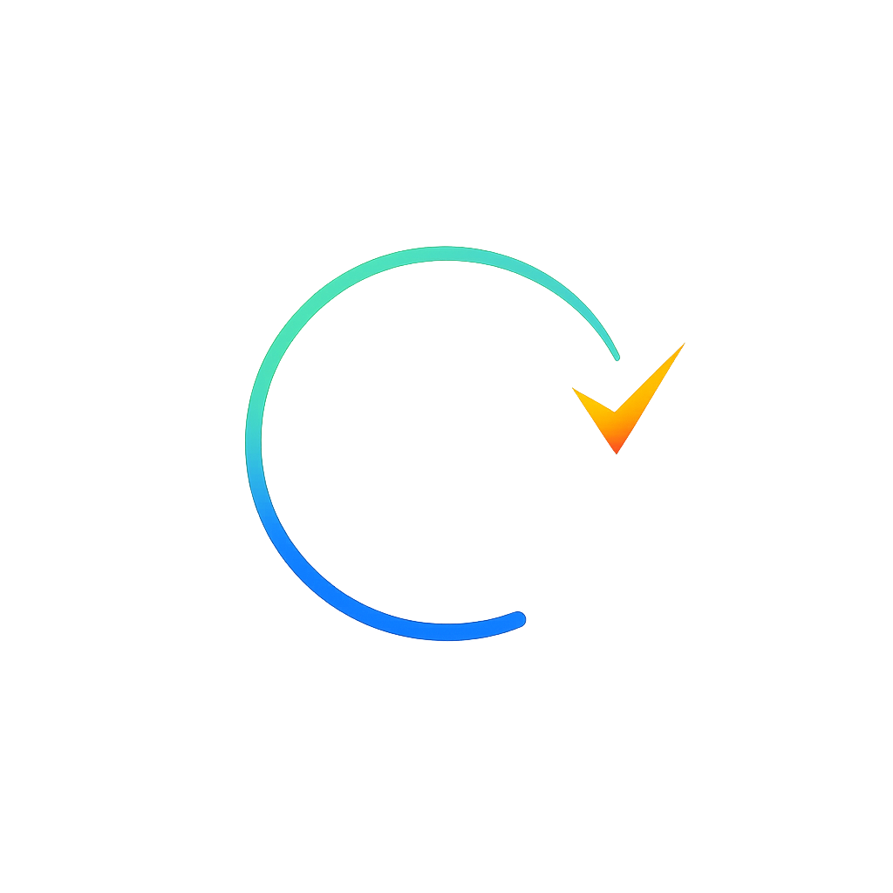

<div align="center">
  
  <h1>Chron</h1>
  <p>A timestamped audit trail for every AI conversation — stored locally, owned by you.</p>
</div>

AI tools show when you sent a message. Chron logs when the AI responded too — and keeps a permanent, queryable record of every exchange across every tool you use.

Works with Claude Desktop, Claude Code, Cursor, Windsurf, and any MCP-compatible AI tool.

---

## Why

AI tools produce no audit trail by default. You cannot answer:
- What did the AI say, and when exactly?
- How long did the AI take to respond?
- What was the full conversation that produced this output?
- What did I ask Claude last week about this codebase?

Chron fixes that. Every exchange is logged with a precise local datetime (including timezone offset) to a SQLite file you own. No cloud, no vendor lock-in, no data leaving your machine.

---

## Install

Add to your AI tool's MCP config:

```json
{
  "mcpServers": {
    "chron": {
      "command": "npx",
      "args": ["-y", "chron-mcp"]
    }
  }
}
```

First run creates `~/.chron/chron.db` automatically. No database setup, no env vars, no migrations.

---

## What it logs

Every exchange is recorded with precise local timestamps — user message when received, assistant response when sent:

```
[user: 2026-05-08 14:32:11 +02:00 | assistant: 2026-05-08 14:32:43 +02:00]

The main risks of deploying this contract are...
```

The gap between user and assistant timestamps is real generation time. Both are stored in your local SQLite DB with full timezone offset.

---

## Config by tool

### Claude Desktop

Edit `~/Library/Application Support/Claude/claude_desktop_config.json` (macOS) or `%APPDATA%\Claude\claude_desktop_config.json` (Windows):

```json
{
  "mcpServers": {
    "chron": {
      "command": "npx",
      "args": ["-y", "chron-mcp"]
    }
  }
}
```

### Claude Code

```bash
claude mcp add chron -- npx -y chron-mcp
```

Then add the skill hook to `~/.claude/settings.json`:

```json
{
  "hooks": {
    "SessionStart": [
      {
        "hooks": [
          {
            "type": "command",
            "command": "cat ~/.chron/chron.skill.md"
          }
        ]
      }
    ]
  }
}
```

### Cursor

Edit `~/.cursor/mcp.json`:

```json
{
  "mcpServers": {
    "chron": {
      "command": "npx",
      "args": ["-y", "chron-mcp"]
    }
  }
}
```

### Windsurf

Edit `~/.codeium/windsurf/mcp_config.json`:

```json
{
  "mcpServers": {
    "chron": {
      "command": "npx",
      "args": ["-y", "chron-mcp"]
    }
  }
}
```

---

## Companion skill file

Chron ships with `skills/chron.skill.md` — a plain-text instruction file that tells the AI how to use the MCP tools automatically. Load it into your AI tool once. After that, the AI:

1. Creates or resumes a named session at the start of every conversation
2. Logs your message before it starts responding (captures the real user timestamp)
3. Logs its response after composing it (captures the real assistant timestamp)
4. Shows `[user: YYYY-MM-DD HH:MM:SS ±HH:MM | assistant: YYYY-MM-DD HH:MM:SS ±HH:MM]` at the top of every response
5. Retrieves prior session history so context is never lost across conversations

---

## MCP Tools

| Tool | Description |
|---|---|
| `start_session` | Create or resume a named audit session |
| `log_message` | Record a single message with the current local datetime |
| `log_exchange` | Log a user/assistant pair atomically (for batch imports) |
| `list_sessions` | List all sessions ordered by most recently active |
| `get_session_history` | Retrieve the full timestamped log for a session |

---

## Configuration

| Env var | Default | Description |
|---|---|---|
| `CHRON_DB_PATH` | `~/.chron/chron.db` | Path to SQLite database file |
| `CHRON_TRANSPORT` | `stdio` | Set to `http` to enable HTTP+SSE mode |
| `CHRON_API_KEY` | _(none)_ | Bearer token for HTTP mode |
| `PORT` | `3001` | Port for HTTP mode |

---

## HTTP+SSE mode (team / self-hosted)

For teams or remote use, run Chron as an HTTP server:

```bash
CHRON_TRANSPORT=http CHRON_API_KEY=your-key PORT=3001 npx chron-mcp
```

Point your MCP config at the URL:

```json
{
  "mcpServers": {
    "chron": {
      "url": "https://your-server/mcp",
      "headers": {
        "Authorization": "Bearer your-key"
      }
    }
  }
}
```

---

## Your data

Your audit log lives at `~/.chron/chron.db` — a single SQLite file on your machine. Query it directly with any SQLite tool:

```bash
sqlite3 ~/.chron/chron.db \
  "SELECT s.title, m.role, m.content, m.created_at
   FROM messages m JOIN sessions s ON s.id = m.session_id
   ORDER BY m.created_at"
```

No cloud, no telemetry, no data leaving your machine. Change the location with `CHRON_DB_PATH`.

---

## License

Copyright (c) 2026 Nivaya. All rights reserved.

Source code is public for transparency only. Cloning, forking, modification, and redistribution are not permitted without explicit written permission. See [LICENSE](LICENSE) for full terms.
